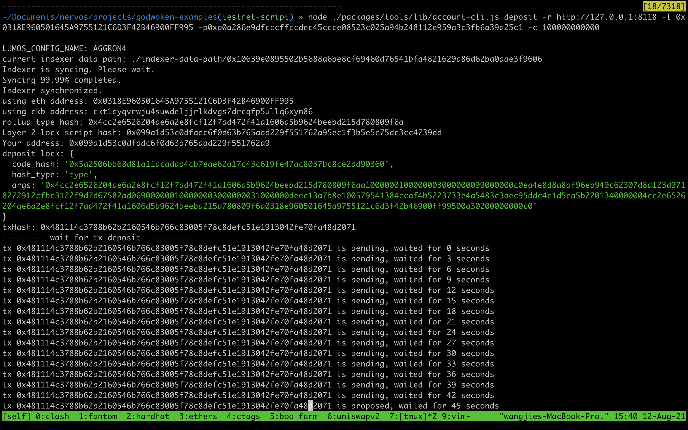

# Task 1. Create A Godwoken Account On The EVM Layer 2 Testnet

1. A screenshot of the accounts you created (account list) in ckb-cli.

```sh
address:
  mainnet: ckb1qyqvrwju4suwdeljjrlkdvgs7drcqfp5ullq8r6vtx
  testnet: ckt1qyqvrwju4suwdeljjrlkdvgs7drcqfp5ullq6xyn86
lock_arg: 0xc1ba5cac38e6e7f290ff66b110f347802434e7fe
lock_hash: 0xc0ea4e8d8a8af96eb949c62307d8d123d9718272912cfbc3122f9d7d67582ad0
```


2. A link to the Layer 1 address you funded on the Testnet Explorer.

link: https://explorer.nervos.org/aggron/address/ckt1qyqvrwju4suwdeljjrlkdvgs7drcqfp5ullq6xyn86


3. A screenshot of the console output immediately after you have successfully submitted a deposit to Layer 2.



