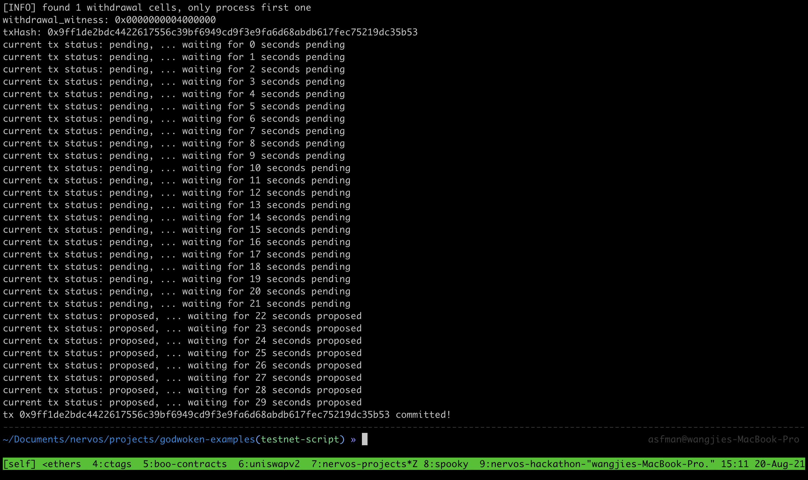

# Gitcoin: 10) Complete Withdrawal Process by Unlocking the Funds

1.A screenshot of the console output immediately after running the "unlock" command.


2.The Ethereum address that you've used for your Layer 2 account (in text format).
```sh
0x0318E960501645A9755121C6D3F42B46900FF995
```

3.The Nervos Layer 1 address associated with the private key passed to "unlock" command (in text format). This is "ckb address" in the console output.
```sh
ckt1qyqvrwju4suwdeljjrlkdvgs7drcqfp5ullq6xyn86
```

