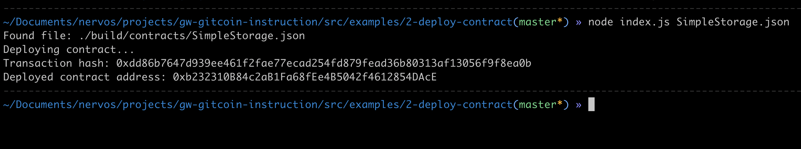

## Task 2 Deploy A Simple Ethereum Smart Contract On Polyjuice

1. A screenshot of the console output immediately after you have successfully deployed a smart contract.

2. The transaction hash from the contract deployment (in text format).

0xdd86b7647d939ee461f2fae77ecad254fd879fead36b80313af13056f9f8ea0b

3. The deployed contract address from the contract deployment (in text format).

0xb232310B84c2aB1Fa68fEe4B5042f4612854DAcE
