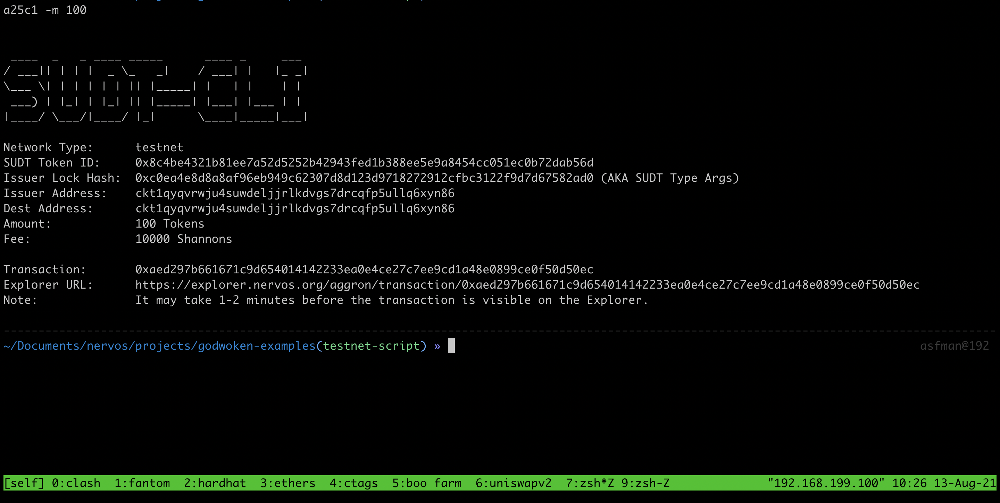

## Task 4 Issue An SUDT Token On Layer 1 And Deposit It To Layer 2

1.A link to the Layer 1 address you funded on the Testnet Explorer.
```sh
https://explorer.nervos.org/aggron/address/ckt1qyqvrwju4suwdeljjrlkdvgs7drcqfp5ullq6xyn86
```

2.A screenshot of the console output immediately after using sudt-cli to create your SUDT tokens on Layer 1.


3.A link to the transaction ID created by sudt-cli on the Testnet Explorer.
```sh
0xaed297b661671c9d654014142233ea0e4ce27c7ee9cd1a48e0899ce0f50d50ec
```

4.A screenshot of the console output immediately after you have successfully submitted a deposit to Layer 2 using the account-cli tool.


5.The SUDT ID from the console output after executing the deposit script (in text format).
```sh
Your sudt id: 2077
```
