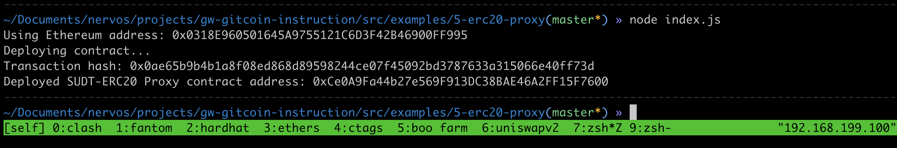
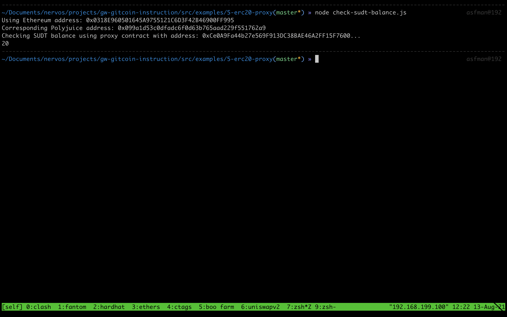

## Task 5 Deploy The ERC20 Proxy Contract For The Deposited SUDT

1.A screenshot of the console output immediately after deploying smart contract.


2.The address of the ERC20 Proxy Contract you deployed (in text format).
```sh
0xCe0A9Fa44b27e569F913DC38BAE46A2FF15F7600
```

3.A screenshot of the console output immediately after checking your SUDT balance.


4.The Ethereum address that was checked (in text format).
```sh
0x0318E960501645A9755121C6D3F42B46900FF995
```
