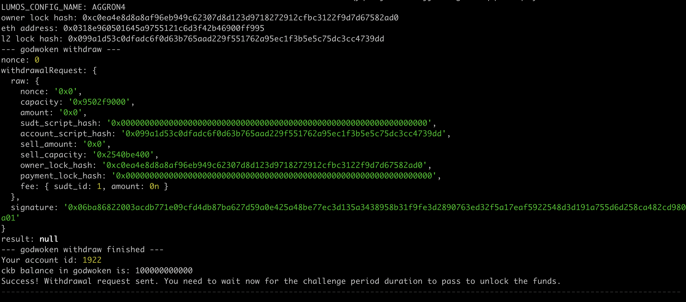

# Gitcoin: 9) Initiate Withdrawal Process From The Layer 2 Back To Layer 1

## 1.A screenshot of the console output immediately after running the withdraw command.

## 2.The Ethereum address that you've used for your Layer 2 account (in text format).

0x0318e960501645a9755121c6d3f42b46900ff995

## 3.The Nervos Layer 1 address that you passed to withdraw command (in text format).

ckt1qyqvrwju4suwdeljjrlkdvgs7drcqfp5ullq6xyn86
